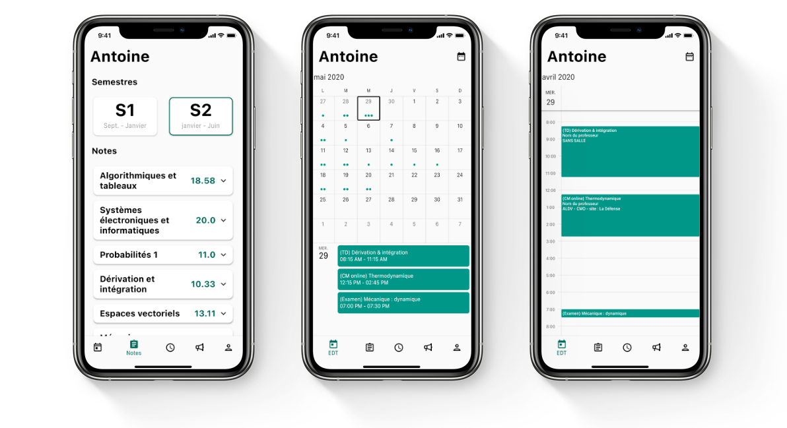

[](https://codemagic.io/apps/5f1aaf9588aa90329c1b72a5/5f1aaf9588aa90329c1b72a4/latest_build)
[](https://discord.gg/wttsfQP)
<p align="center">
<a href="https://play.google.com/store/apps/details?id=eu.araulin.devinci"></a>
<a href="https://testflight.apple.com/join/HUgzMmbA"></a>

</p>

<p align="center">
  <a href="https://github.com/antoineraulin/devinci-app"></a>
</p>
<span align="center">

# Devinci

</span>



## Présentation

**Devinci** est une application qui a pour but de faciliter l'utilisation du portail étudiant du pôle Léonard De Vinci. Cela passe notamment par la connexion automatique, sans devoir entrer ses identifiants à chaque utilisation, des informations accessibles facilement, des notifications pour prévenir d'une nouvelle note, la possibilité de se marquer présent depuis l'application, un mode nuit ou encore l'accès aux documents importants.

<a href="https://devinci.araulin.tech/" style="cursor: pointer;display: inline-block;text-align: center;white-space: nowrap;font-size: 12px;line-height: 1.17648;font-weight: 400;letter-spacing: -0.022em;min-width: 28px;padding-left: 16px;padding-right: 16px;padding-top: 8px;padding-bottom: 8px;border-radius: 18px;background: #0071e3;color: white;text-decoration: none;">En savoir plus</a>

- [Devinci](#devinci)
  - [Présentation](#présentation)
  - [Build Instructions](#build-instructions)
  - [Technologies](#technologies)
  - [Contribution](#contribution)
  - [Dépendances](#dépendances)

## Build Instructions

1. Installer la dernière version de [Flutter](https://flutter.dev/docs/get-started/install).
2. Pour Android vous devez avoir installé Android-Studio, pour iOS vous devez avoir un Mac avec Xcode et les [Xcode developer tools](https://developer.apple.com/xcode/downloads/) installés. Normalement tout est très bien détaillé sur le site de Flutter.
3. Obtenir une clé de license pour le widget de Syncfusion : [ici](https://www.syncfusion.com/products/communitylicense), elle est gratuite.
4. Ouvrez le projet dans votre IDE (VS Code ou Android Studio), ils doivent être configuré pour supporter Flutter.
5. Créer le fichier **`lib/config.dart`** :
   ```dart
   abstract class Config {
     static String syncfusionLicense = 'NT8mJyc2I****************************'; //remplacer par la clé de license de Syncfusion
   }
   ```
6. Récupérer les dépendances : ouvrez un terminal de commande au niveau du dossier racine du projet et faites :
   ```console
   pub get
   ```
7. Pour générer un apk (Android) :
   - [générer un clé de signature](https://flutter.dev/docs/deployment/android#signing-the-app)
   - créer le fichier **`android/key.properties`** : 
      ```properties
      storePassword=********
      keyPassword=********
      keyAlias=key
      storeFile=C:\\Users\\[VOTRE NOM D'UTILISATEUR]\\key.jks
      ```
   - Pour un appareil 64 bits:
     ```console
     flutter build apk --target-platform=android-arm64
     ```
   - Pour un appareil 32 bits:
     ```console
     flutter build apk --target-platform=android-arm
     ```
8. Pour installer l'app sur iOS :
   - Brancher un appareil iOS sur votre Mac puis:
     ```console
     flutter run
     ```
     Ou <kbd>Fn</kbd>+<kbd>F5</kbd> sur VS Code

<a href="https://devinci.araulin.tech/beta.html" style="cursor: pointer;display: inline-block;text-align: center;white-space: nowrap;font-size: 12px;line-height: 1.17648;font-weight: 400;letter-spacing: -0.022em;min-width: 28px;padding-left: 16px;padding-right: 16px;padding-top: 8px;padding-bottom: 8px;border-radius: 18px;background: #0071e3;color: white;text-decoration: none;">Installation simplifiée</a>

## Technologies

- ### Flutter/Dart
  Ce projet repose en grande partie sur le framework [Flutter](https://flutter.dev/) créé par Google et basé sur le langage [Dart](https://dart.dev/) afin de proposer une expérience similaire sur Android et iOS. _Voir le projet sur [GitHub](https://github.com/flutter/flutter)_
- ### Firebase Crashlytics
  Devinci utilise les services de Firebase Crashlytics pour remonter les bugs/erreurs au développeur.
- ### Syncfusion flutter widgets
  Il s'agit (à ma connaissance) de la seule dépendance non entièrement open-source puisque elle requiert une clé de license ([gratuite](https://www.syncfusion.com/products/communitylicense) pour les projets non commerciaux). Les widgets flutter de Syncfusion sont utilisés pour afficher l'emploi du temps dans l'application. [En savoir plus](https://www.syncfusion.com/flutter-widgets/flutter-calendar)

## Contribution

Vous souhaitez contribuer ? Prenez connaissance des [lignes directions de contribution](CONTRIBUTING.md)

## Dépendances

Voir dans le fichier [pubsec.yaml](https://github.com/antoineraulin/devinci-app/blob/master/pubspec.yaml)
